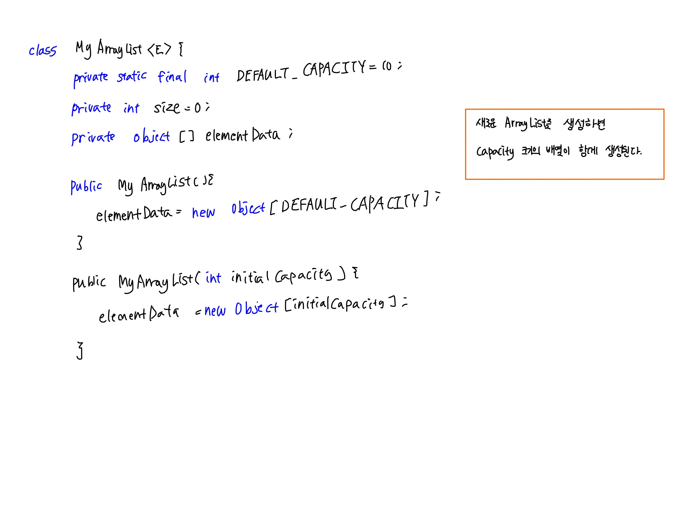
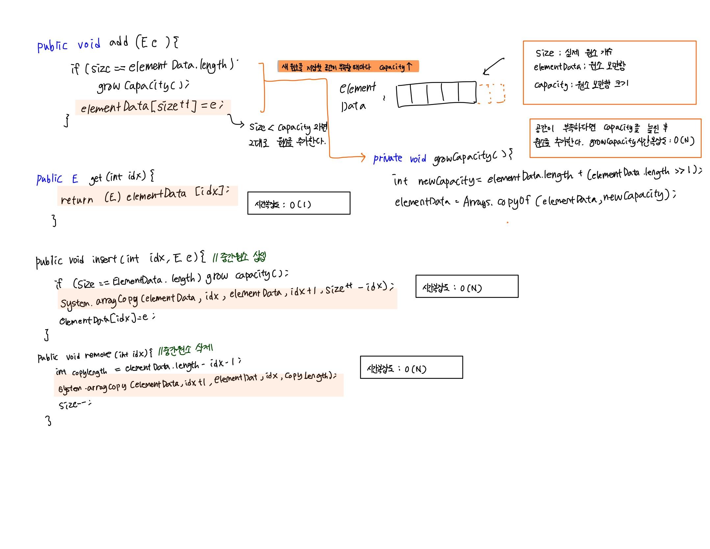

# 배열과 리스트

### Array
- 동일한 타입의 여러 원소를 선형 집합으로 관리하는 정적 데이터 구조
- 생성과 동시에 크기가 고정되어 늘릴 수 없다.
- 메모리 상에 일렬로 저장되어 Random Access가 가능하다.

|Operation|Description|Complexity|
|---|---|---|
|add(int idx)|idx번째 원소 반환| O(1)|
|add(E e) | 배열의 가장뒤에 원소 e 추가 | O(1)|
|insert(int idx, E e)| idx번째 앞에 원소 e tkdql | O(N)|
|remove(int idx)|idx번째 원소를 삭제|O(N)|

원소에 접근하고 변경하는 것은 빠르지만 주안 원소를 추가/삭제시 연속적인 상태를 유지하기 위해 원소를 옮기는 작업 필요

### List
- 동일한 타입의 여러 원소를 선형 집합으로 관리하는 **동적** 데이터 구조
- 원소가 추가/삭제됨에 따라 크기가 변경될 수 있다.
- List Interface구현체에 따라 특성이 다르다.
- ArrayList: index를 통한 원소 접근이 빠름 , 원소의 삽입/제거가 느림
- LinkedList: index를 통한 원소 접근이 느림, 원소의 삽입/제거가 빠름

- **List Interface** : 순서가 있는 Collection인덱스를 통한 원소 저장 가능 ListIterator를 제공

| Operations                | Description             |
|---------------------------|-------------------------|
| get(int index)            | 지정된 위치에 있는 원소 반환        |
| indexOf(Object o)         | 지정된 원소의 첫 번째 출현 인덱스 반환  |
| add(E e)                  | 리스트의 끝에 원소 추가           |
| add(int index, E element) | 지정한 위치에 원소 삽입           |
| remove(int index)         | 지정한 위치의 원소 제거           |
| remove(Object o)          | 첫번째로 나타나는 지정된 원소 제거     |
| set(int index, E element) | 지정된 위치의 원소를 변경          |
| contains(Object e)        | 원소를 포함하고 있는지 여부를 반환     
| subList(int from, int to) | 지정된 부분 범위 **뷰**를 반환     |
| toArray()                 | 모든 원소를 동일한 순서로 가진 배열 반환 |
| size()                    | 리스트의 원소 개수를 반환|
| isEmpty()                 | 리스트가 비어있는지 여부를 반환|
| listIterator()            | 리스트에 대한 ListIterator반환|
| listIterator(int index)   | 지정위치에서 시작하는 ListIterator 반환|
| clear()                   | 리스트의 모든 원소 삭제 |
| equals(Object o)          | 전달받은 객체와 리스트가 같은지 비교|

### 1. ArrayList : 동적 배열을 사용한 List 구현체
- 원소가 추가될때 배열에 남은 공간이 없다면 크기를 일정 배수로 늘린 배열을 만들어 기존 원소를 옮긴다.
- 원소가 배열에 저장되어 있기 때문에 지정한 위치의 원소 접근이 빠르다.
- 중간 원소의 삽입/제거 연산은 기존 배열 연산과 같이 해당 위치 이후의 모든 원소를 이동시키미로 느리다.

### 2. LinkedList: 차례로 연결된 Node를 사용한 구현체
- 원소가 추가/삭제될때마다 해당 원소의 Node가 추가/삭제된다.
- 지정된 위치의 원소에 접근하기 위해서는 선형탐색이 필요하다.
- 순차적인 접근 시 Iterator를 사용해 효율적으로 관리 가능하다.
- 중간 원소 삽입/제거 연산은 해당 Node와 연결된 참조값만을 갱신하여 다른 Node에 영향을 미치지 않는다.

